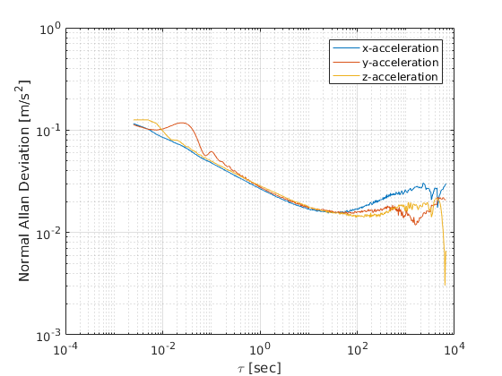
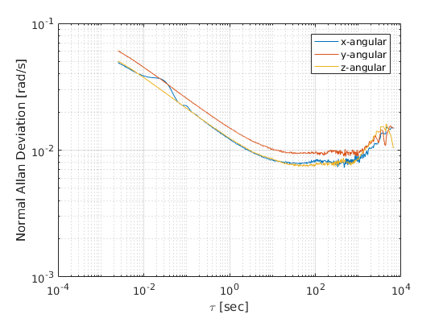

# kalibr_allan

This has some nice utility scripts and packages that allow for calculation of the noise values for use in both kalibr and IMU filters.
The dataset of the manufacture can find the "white noise" values for the system, but the bias noises need to be found through experimental tests.
The `gyroscope_random_walk` and `accelerometer_random_walk` values can normally be found on the IMU datasheet as either angular random walk or velocity random walk, respectively.

## IMU Noise Values

Parameter | YAML element | Symbol | Units
--- | --- | --- | ---
Gyroscope "white noise" | `gyroscope_noise_density` |  | 
Accelerometer "white noise" | `accelerometer_noise_density` |  | 
Gyroscope "random walk" | `gyroscope_random_walk` |  | 
Accelerometer "random walk" | `accelerometer_random_walk` |  | 

## Experiment Steps

1. With the IMU remaining still, record a ROS bag of the readings (we collected a bag for about 4 hours)
2. Convert the ROS bag into a matlab mat file.
    * Use the included `bagconvert` ROS package to do this
    * Example: `rosrun bagconvert bagconvert imu.bag /imu0`
3. Run the included matlab scripts to generate an allan deviation plot for the readings
    * We have multiple versions of the script
    * We do *not* recommend the ROS version as matlab parsing of raw ROS bags is slow
    * If using ROS version, it uses the matlab robotics toolbox
    * If using the parallel version, it uses the matlab parallel toolbox
4. TODO: Interpret the generated charts to find noise values

## Example Plots (xsens mti-G-700)

